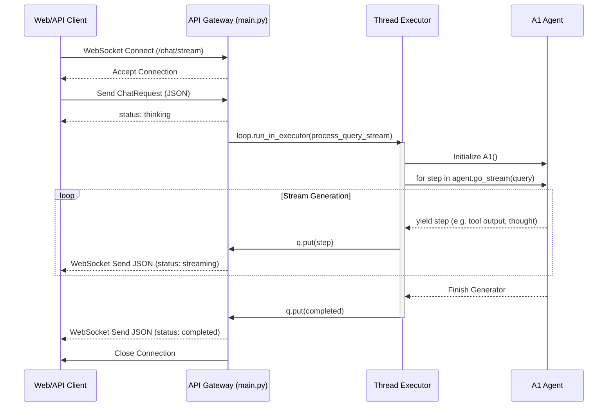

# API Gateway (网关层) 架构设计

API Gateway 是外部客户端（如 Web UI、测试脚本）与 Biomni-Agent 后端大脑通信的唯一入口。

## 1. 核心职责
- **协议适配**：提供标准的 RESTful 接口(`/api/v1/chat`) 和全双工 WebSocket 接口(`/api/v1/chat/stream`)。
- **并发控制**：将耗时的 Agent 生成任务推送到专用的线程池（`asyncio.to_thread` / `run_in_executor`）中执行，确保 FastAPI 事件循环不会被阻塞。
- **流式推送**：利用 `queue.Queue` 进行线程间通信，将 Agent 的 `go_stream()` 生成器产出的细粒度步骤实时转换为 JSON 格式下发至客户端。

## 2. 内部工作流程图

