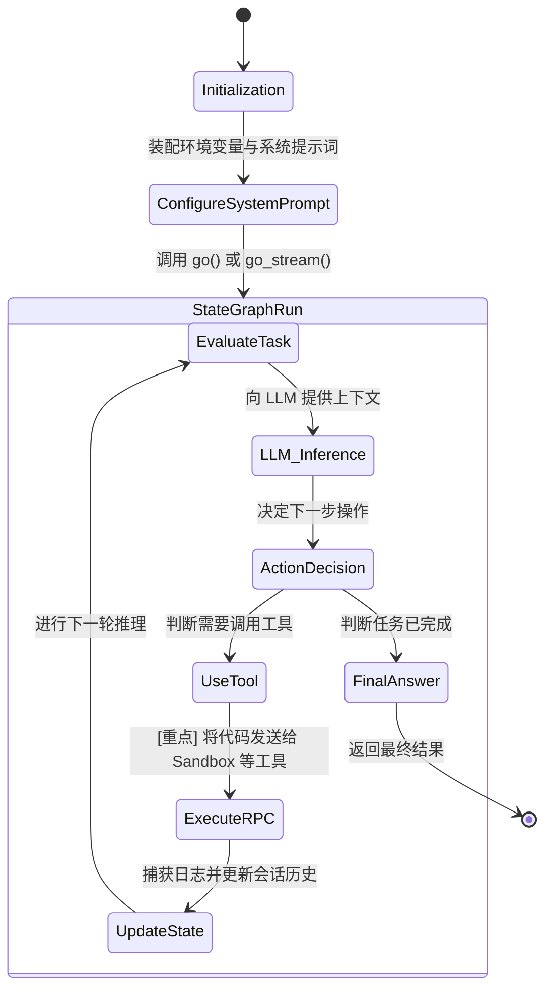

# Agent Core (核心规划层) 架构设计

Agent Core (`A1` 及其底层的 LangGraph 引擎) 是 Biomni-Agent 系统的大脑，负责理解任务、检索知识和调度工具。

## 1. 核心职责
- **提示词工程**：动态加载环境配置，根据 `commercial_mode` 等参数装配 System Prompt。
- **工具挂载**：通过 `ToolRegistry` 管理系统内置工具以及动态添加的自定义工具，并将其注入大模型上下文。
- **图引擎执行**：使用 `langgraph.graph.StateGraph` 管理 Agent 执行状态，处理大模型多次循环调用工具的复杂编排。

## 2. 内部工作流程图

